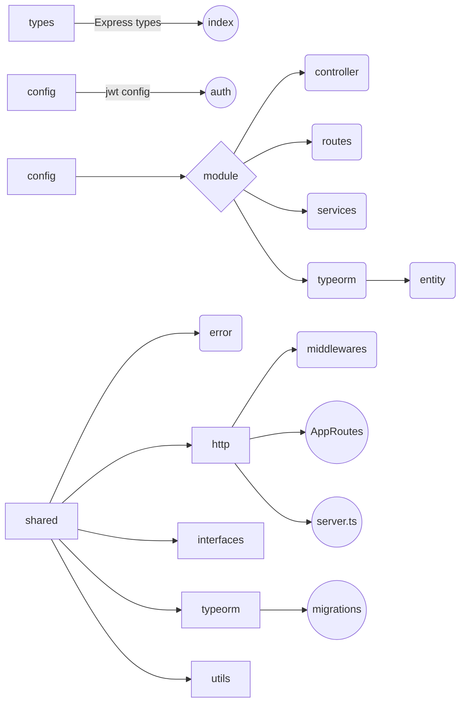

# Welcome to Todo List backend!
Hi, This is the Todo Client backend service. This is a project where i'm trying/learning new techs.
Here, I'm using:

Typescript
NodeJS
Typeorm
Postgres
Babel
ExpressJs
Joi

# Instructions

To use this app, you must need:  
Node (16x) 
Postgres
Dbaver Community (Optional, but will help)
Yarn or NPM 
And a device to run everthing 😁 

First: 
Run this script in app root folder : "yarn" to install all deps 
Nice, if everything looks good, run "yarn dev" to run the app 

Second, you need host the postgres in some online Service or intall localy:
If you want host, I recommend supabase. (But I'm not teach how to do that.)

For run locally, you must need have Postgres installed.
https://www.postgresql.org/download/

Connect your postgres in your dbeaver tool, and create a db called "todo"

On the project root folder, run "yarn typeorm migration:run" to create all migrations, this command will create all table of our project.

**Note:  If occur an error when you execute the command above, maybe it because you install postgres with some credentials different than the default. (password, name ...), you must need change with correct info in ormconfig.js located in the root of our project. And try again the command above.**

If everything ok, you are able to use the project. Create an user, login and make tasks CRUD. 

**Resume** 
1°  yarn 
2° install postgres
3° create an table called todo with dbeaver tool in your local postgres
4° run migration
5° yarn dev  
6° use the app.

# Files

# Issues
If you have some trouble to execute the project, send a message, it will be a pleasure help you.

**NOTE: THIS IS A BACKEND SERVICE, THIS RUN WITH A CLIENT: **
